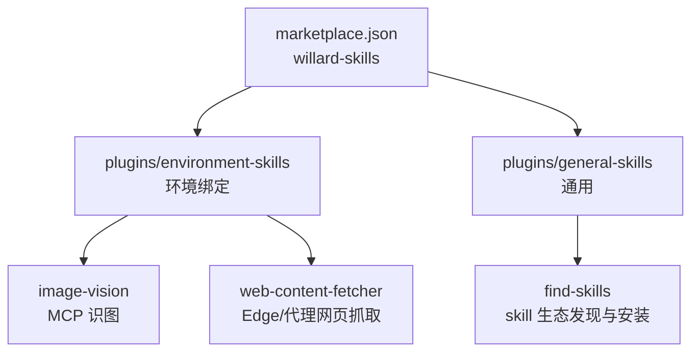

<div align="center">

# Willard Skills

**个人 Claude 插件市场（Plugin Marketplace）· 单一事实源**

Claude Code（code 侧）与 Claude Desktop / Cowork（cowork 侧）共用的 skills 仓库。

</div>

---

## 这是什么

一个按官方 **Agent Skills 规范**（agentskills.io）组织的插件市场仓库，作为本机所有 skills 的**唯一事实源**：

- **code 侧**（Claude Code）：仓库是权威，`~/.claude/skills/` 下的 skill 目录是指向本仓库的 **junction**，改仓库即分发，杜绝双库漂移。
- **cowork 侧**（Claude Desktop）：把本仓库作为 marketplace 添加进 Customize → Plugins，安装插件后与 code 侧同源。

## 结构总览



```
~/.claude/skills-repo/                 ← 本仓库（git，唯一事实源）
├── .claude-plugin/
│   └── marketplace.json               ← 注册下面两个插件
└── plugins/
    ├── environment-skills/            ← 插件 1：本机环境绑定
    │   ├── .claude-plugin/plugin.json
    │   └── skills/
    │       ├── image-vision/          ← MCP 识图（analyze_image / ocr_image）
    │       └── web-content-fetcher/   ← 网页正文抓取（Edge + 系统代理）
    └── general-skills/                ← 插件 2：通用
        ├── .claude-plugin/plugin.json
        └── skills/
            └── find-skills/           ← skill 生态发现与安装
```

## 安装与分发

### code 侧（Claude Code）

`~/.claude/skills/<name>` 是指向本仓库对应目录的 **junction**（Windows 上无需管理员权限的 `mklink /J`）。
skill 目录即改即生效，重启 Claude Code 后加载。

```text
~/.claude/skills/
├── find-skills          → skills-repo/plugins/general-skills/skills/find-skills
├── image-vision         → skills-repo/plugins/environment-skills/skills/image-vision
└── web-content-fetcher  → skills-repo/plugins/environment-skills/skills/web-content-fetcher
```

### cowork 侧（Claude Desktop）

在 **Customize → Plugins** 添加本仓库为 marketplace，安装 `environment-skills` 与 `general-skills` 两个插件。

## 维护规范

同一 skill 只维护一份。改 skill = 改本仓库 + git commit，两库自动同步。

```bash
git -C ~/.claude/skills-repo add .
git -C ~/.claude/skills-repo commit -m "描述改动"
git -C ~/.claude/skills-repo push
```

新增 skill 时：

1. 判断归属：环境绑定 → `environment-skills/skills/`；通用 → `general-skills/skills/`
2. 拷入内容（保留来源 LICENSE），提交并 push
3. 在 `~/.claude/skills/` 下建 junction：
   ```bash
   python3 -c "import subprocess;link=r'C:\Users\Willard\.claude\skills\<name>';target=r'C:\Users\Willard\.claude\skills-repo\plugins\<plugin>\skills\<name>';subprocess.run(['cmd','/c','rmdir',link],capture_output=True);import os;os.makedirs(r'C:\Users\Willard\.claude\skills',exist_ok=True);subprocess.run(['cmd','/c','mklink','/J',link,target],check=True)"
   ```
4. 重启 Claude Code / 刷新插件市场验证。

## Skill 清单

| Skill | 插件 | 作用 |
|---|---|---|
| image-vision | environment-skills | MCP 识图：看图/OCR/UI 评审/图表提取（纯文本模型无视觉时唯一读图通道） |
| web-content-fetcher | environment-skills | 任意 URL 转干净 Markdown：公众号/掘金/CSDN/海外博客 |
| find-skills | general-skills | 从 skill 生态（skills.sh）发现并安装 skill，落库走本仓库流程 |

## 兼容性

- 结构遵循 [Agent Skills Spec](https://agentskills.io/specification)（扁平 `skills/<name>/SKILL.md` + 可选 `scripts/` `references/` `assets/`）
- 适配环境：Windows 10 Enterprise / Claude Code / Claude Desktop
