<div align="center">

# Willard Skills

**个人 Claude 插件市场(Plugin Marketplace)· 单一事实源**

Claude Code(code 侧)与 Claude Desktop / Cowork(cowork 侧)共用的 skills 仓库,按官方 [Agent Skills 规范](https://agentskills.io/specification) 组织。

</div>

---

## 维护规范

**权威流程以仓库根 CLAUDE.md 为准**(进入仓库编辑时自动加载)。核心规则:

### 发布流程

同一 skill 只维护一份。改 skill = 改本仓库 + commit + push,两侧各自更新:

```bash
git -C ~/.claude/skills-repo add .
git -C ~/.claude/skills-repo commit -m "描述改动"
git -C ~/.claude/skills-repo push
```

发布靠插件版本号驱动,每改必动:

1. 编辑 `plugins/<插件名>/.claude-plugin/plugin.json`,`version` 升一位(如 1.0.1 → 1.0.2)。两侧插件市场只以版本号判断是否需要重新拉取,版本不变则视为已最新、不更新。
2. 提交推送。
3. **同步本机镜像**:嵌入式 Claude Code 的 `/plugin marketplace update` 不执行 git fetch,发布后不手动对齐镜像,本机就看不到新版本:

   ```bash
   python ~/.claude/skills-repo/scripts/sync-marketplace.py
   ```

4. 更新两侧:cowork 端 Customize → Plugins 点「更新」;code 端 `/plugin marketplace update`,然后重启 Claude Code。

### 新增 skill

1. 判断归属:环境绑定 → `environment-skills/skills/`;通用 → `general-skills/skills/`;游戏开发 → `phaser-skills/skills/`(Phaser 4 官方镜像)或 `game-design-skills/skills/`(设计通识/素材)。
2. 拷入内容(保留来源 LICENSE),提交并 push。
3. 两侧各自更新插件,skill 以 `<插件名>:<skill名>` 前缀加载。

### 禁止事项

- **不要**往 `~/.claude/skills/` 拷文件或建 junction——skill 一律从插件市场分发。
- 两侧各自安装、隔离加载、互不读取。

---

## 结构总览

```mermaid
graph TD
    M[marketplace.json<br/>willard-skills] --> E[plugins/environment-skills<br/>环境绑定 · 2]
    M --> G[plugins/general-skills<br/>通用 · 10]
    M --> PS[plugins/phaser-skills<br/>Phaser 4 官方 · 9]
    M --> GD[plugins/game-design-skills<br/>设计通识/素材 · 5]
    E --> E1[web-content-fetcher]
    E --> E2[see-image]
    G --> G1[find-skills]
    G --> G2[code-review]
    G --> G3[diagnosing-bugs]
    G --> G4[research]
    G --> G5[grill-me]
    G --> G6[handoff]
    G --> G7[skill-review]
    G --> G8[to-spec]
    G --> G9[teach]
    G --> G10[wait-what]
    PS --> PS1[audio-and-sound]
    PS --> PS2[cameras]
    PS --> PS3[input-keyboard-mouse-touch]
    PS --> PS4[loading-assets]
    PS --> PS5[particles]
    PS --> PS6[render-textures]
    PS --> PS7[scenes]
    PS --> PS8[tweens]
    PS --> PS9[v4-new-features]
    GD --> GD1[game-feel]
    GD --> GD2[game-ui-ux]
    GD --> GD3[audio-design]
    GD --> GD4[game-assets]
    GD --> GD5[game-audio]
```



---

## 安装与分发

### cowork 侧(Claude Desktop)

在 **Customize → Plugins** 添加本仓库为 marketplace,安装 `environment-skills`、`general-skills`、`phaser-skills`、`game-design-skills` 四个插件。

### code 侧(Claude Code)

marketplace 已注册在 `extraKnownMarketplaces`,用非交互 CLI 或会话内 `/plugin` 安装:

```bash
claude plugin install "environment-skills@willard-skills"
claude plugin install "general-skills@willard-skills"
claude plugin install "phaser-skills@willard-skills"
claude plugin install "game-design-skills@willard-skills"
```

---

## Skill 清单

| Skill | 插件 | 作用 |
|---|---|---|
| web-content-fetcher | environment-skills | 任意 URL 转干净 Markdown：公众号/掘金/CSDN/海外博客 |
| see-image | environment-skills | 识图：引导调用 MCP server vision（mcp__vision__see_image / see_clipboard，硅基流动视觉模型），MCP 不可用时兜底 vision-cli.cjs |
| find-skills | general-skills | 从 skill 生态（skills.sh）发现并安装 skill |
| code-review | general-skills | 代码审查：需求轴 + 规范轴双维度 |
| diagnosing-bugs | general-skills | 反馈回路式 bug 排查 |
| research | general-skills | 只用可靠一手来源做查证 |
| grill-me | general-skills | 动手前用决策树追问需求 |
| handoff | general-skills | 会话收尾 + 交接文档 |
| skill-review | general-skills | 审查 skill 能否达到目标效果 |
| to-spec | general-skills | 把已拍板需求固化成语义 spec |
| teach | general-skills | 跨会话教学工作区 |
| wait-what | general-skills | 用户没懂时换方式重讲 |
| audio-and-sound | phaser-skills | Phaser 4 音频：加载/播放/音量/Web Audio（来源 phaserjs/phaser 官方） |
| cameras | phaser-skills | 镜头效果：shake/fade/flash/zoom/跟随/minimap |
| input-keyboard-mouse-touch | phaser-skills | 键盘/鼠标/触摸/指针/拖拽/游戏手柄输入 |
| loading-assets | phaser-skills | 资源加载：图片/图集/音频/JSON/加载进度 |
| particles | phaser-skills | 粒子发射器：爆炸/火焰/烟雾等特效 |
| render-textures | phaser-skills | RenderTexture/DynamicTexture：离屏绘制/快照/stamp |
| scenes | phaser-skills | 场景生命周期/过渡/暂停/SceneManager |
| tweens | phaser-skills | 缓动动画：链式/缓动函数/stagger/yoyo |
| v4-new-features | phaser-skills | Phaser 4 新特性：RenderNode/过滤器/着色器/新 tint |
| game-feel | game-design-skills | 手感打磨：屏震/停顿帧/挤压拉伸/击退（来源 gamedev-skills） |
| game-ui-ux | game-design-skills | 游戏 UI/UX：锚点 HUD/安全区/分辨率适配 |
| audio-design | game-design-skills | 音频设计原则：音乐/音效分层 |
| game-assets | game-design-skills | 游戏素材生成工作流（来源 opusgamelabs/game-creator） |
| game-audio | game-design-skills | Web Audio 程序化音效/音乐（零依赖） |

---

## 与官方 skill 的关系

本机另有官方 **anthropic-skills** 插件(工作流/文档类:docx/pdf/pptx/xlsx、schedule、setup-cowork 等),code 侧经 `anthropic-skills:` 前缀可用,与自建 skill 不冲突。

## 兼容性

- 结构遵循 [Agent Skills Spec](https://agentskills.io/specification)(扁平 `skills/<name>/SKILL.md` + 可选 `scripts/` `references/` `assets/`)
- 适配环境:Windows 10 Enterprise / Claude Code / Claude Desktop
