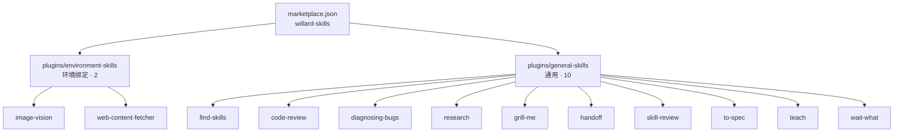

<div align="center">

# Willard Skills

**个人 Claude 插件市场（Plugin Marketplace）· 单一事实源**

Claude Code（code 侧）与 Claude Desktop / Cowork（cowork 侧）共用的 skills 仓库。

</div>

---

## 这是什么

一个按官方 **Agent Skills 规范**（agentskills.io）组织的插件市场仓库，作为本机所有自建 skills 的**唯一事实源**：

- **cowork 侧**（Claude Desktop）：Customize → Plugins 添加本仓库为 marketplace，安装插件。
- **code 侧**（Claude Code）：通过 `claude plugin` / `/plugin` 从同一 marketplace 安装插件。
- 两侧**各自安装、隔离加载、互不读取**，skill 以带插件前缀加载（`environment-skills:image-vision` 等），无裸名版。
- 已废弃 junction/手动拷贝分发——不要往 `~/.claude/skills/` 拷文件或建 junction。

## 结构总览



```
~/.claude/skills-repo/                 ← 本仓库（git，唯一事实源）
├── .claude-plugin/
│   └── marketplace.json               ← 注册下面两个插件
└── plugins/
    ├── environment-skills/            ← 插件 1：本机环境绑定（2 个）
    │   ├── .claude-plugin/plugin.json
    │   └── skills/
    │       ├── image-vision/          ← MCP 识图（analyze_image / ocr_image）
    │       └── web-content-fetcher/   ← 网页正文抓取（Edge + 系统代理）
    └── general-skills/                ← 插件 2：通用工作流（10 个）
        ├── .claude-plugin/plugin.json
        └── skills/
            ├── find-skills/           ← skill 生态发现与安装
            ├── code-review/           ← 代码审查（需求轴+规范轴）
            ├── diagnosing-bugs/       ← 反馈回路式排障
            ├── research/              ← 可靠来源查证
            ├── grill-me/              ← 动手前追问需求
            ├── handoff/               ← 会话收尾 + 交接
            ├── skill-review/          ← skill 效果审查
            ├── to-spec/               ← 规格文档固化
            ├── teach/                 ← 跨会话教学工作区
            └── wait-what/             ← 换方式重讲
```

## 安装与分发

### cowork 侧（Claude Desktop）

在 **Customize → Plugins** 添加本仓库为 marketplace，安装 `environment-skills` 与 `general-skills` 两个插件。

### code 侧（Claude Code）

用非交互 CLI 或会话内 `/plugin` 安装（marketplace 已注册在 `extraKnownMarketplaces`）：

```bash
claude plugin install "environment-skills@willard-skills"
claude plugin install "general-skills@willard-skills"
```

## 维护规范

权威流程以仓库根 **CLAUDE.md** 为准（进入仓库编辑时自动加载）。核心规则：

同一 skill 只维护一份。改 skill = 改本仓库 + commit + push，两侧各自更新：

```bash
git -C ~/.claude/skills-repo add .
git -C ~/.claude/skills-repo commit -m "描述改动"
git -C ~/.claude/skills-repo push
```

- 每改一次 skill，`plugins/<插件名>/.claude-plugin/plugin.json` 的 `version` 必须升一位（如 1.0.1 → 1.0.2）。两侧插件市场只以版本号判断是否需要重新拉取，版本不变则视为已最新、不更新。
- **cowork 侧更新**：Customize → Plugins 点「更新」。
- **code 侧更新**：`claude plugin marketplace update` 或会话内 `/plugin marketplace update`。
- **不要**往 `~/.claude/skills/` 拷文件或建 junction——skill 一律从插件市场分发。

新增 skill 时：

1. 判断归属：环境绑定 → `environment-skills/skills/`；通用 → `general-skills/skills/`
2. 拷入内容（保留来源 LICENSE），提交并 push
3. 两侧各自更新插件，skill 以 `<插件名>:<skill名>` 前缀加载

## Skill 清单

| Skill | 插件 | 作用 |
|---|---|---|
| image-vision | environment-skills | MCP 识图：看图/OCR/UI 评审/图表提取（纯文本模型无视觉时唯一读图通道） |
| web-content-fetcher | environment-skills | 任意 URL 转干净 Markdown：公众号/掘金/CSDN/海外博客 |
| find-skills | general-skills | 从 skill 生态（skills.sh）发现并安装 skill |
| code-review | general-skills | 代码审查：需求轴 + 规范轴双维度 |
| diagnosing-bugs | general-skills | 反馈回路式 bug 排查 |
| research | general-skills | 只用可靠一手来源做查证 |
| grill-me | general-skills | 动手前用决策树追问需求 |
| handoff | general-skills | 会话收尾 + 交接文档 |
| skill-review | general-skills | 审查 skill 能否达到目标效果 |
| to-spec | general-skills | 把已拍板需求固化成语义 spec |
| teach | general-skills | 跨会话教学工作区 |
| wait-what | general-skills | 用户没懂时换方式重讲 |

## 与官方 skill 的关系

- 本机另有官方 **anthropic-skills** 插件（工作流/文档类：docx/pdf/pptx/xlsx、schedule、setup-cowork 等），code 侧经 `anthropic-skills:` 前缀可用，与自建 skill 不冲突。
- 审查排除项：agent-norms（约束类，已并入 CLAUDE.md 常驻）、沙箱类 skill（本机 Windows 无沙箱）、wrap-up（已合并进 handoff）。

## 兼容性

- 结构遵循 [Agent Skills Spec](https://agentskills.io/specification)（扁平 `skills/<name>/SKILL.md` + 可选 `scripts/` `references/` `assets/`）
- 适配环境：Windows 10 Enterprise / Claude Code / Claude Desktop
